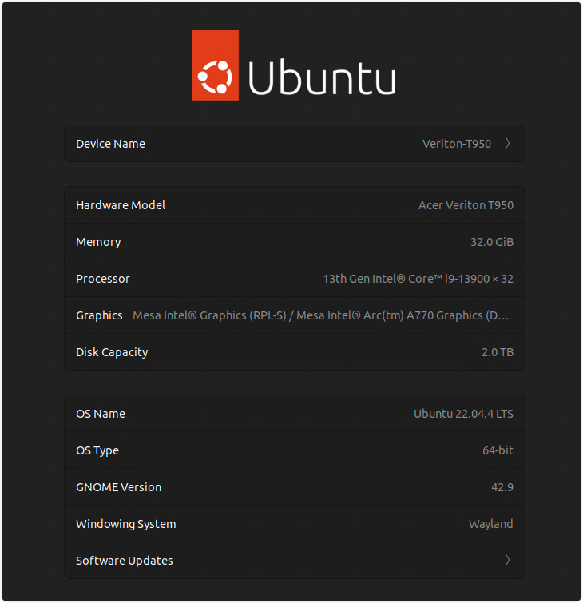
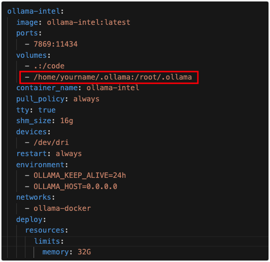

# Ollama Run LLM on Intel Arc GPU

**通过Ollama使用英特尔Arc GPU运行LLM**

## 实现方式

通过英特尔官方的[IPEX-LLM PyTorch library](https://github.com/intel-analytics/ipex-llm)

## 硬件和系统



## 主机模式

### 显卡驱动

参照：[Install IPEX-LLM on Linux with Intel GPU]([ipex-llm/docs/mddocs/Quickstart/install_linux_gpu.md at main · intel-analytics/ipex-llm (github.com)](https://github.com/intel-analytics/ipex-llm/blob/main/docs/mddocs/Quickstart/install_linux_gpu.md))

注意：

1. 安装驱动之前，先执行 `apt update` 和 `apt upgrade -y`

2. Ubuntu 22.04系统内核是6.5，按驱动安装参照链接安装依赖：[For Linux kernel 6.5](https://github.com/intel-analytics/ipex-llm/blob/main/docs/mddocs/Quickstart/install_linux_gpu.md#for-linux-kernel-65)

   - Install wget, gpg-agent

     ```
     sudo apt-get install -y gpg-agent wget
     wget -qO - https://repositories.intel.com/gpu/intel-graphics.key | \
     sudo gpg --dearmor --output /usr/share/keyrings/intel-graphics.gpg
     echo "deb [arch=amd64,i386 signed-by=/usr/share/keyrings/intel-graphics.gpg] https://repositories.intel.com/gpu/ubuntu jammy client" | \
     sudo tee /etc/apt/sources.list.d/intel-gpu-jammy.list
     ```

   - Install drivers

     ```
     sudo apt-get update
     sudo apt-get -y install \
         gawk \
         dkms \
         linux-headers-$(uname -r) \
         libc6-dev
     
     sudo apt-get install -y gawk libc6-dev udev\
         intel-opencl-icd intel-level-zero-gpu level-zero \
         intel-media-va-driver-non-free libmfx1 libmfxgen1 libvpl2 \
         libegl-mesa0 libegl1-mesa libegl1-mesa-dev libgbm1 libgl1-mesa-dev libgl1-mesa-dri \
         libglapi-mesa libgles2-mesa-dev libglx-mesa0 libigdgmm12 libxatracker2 mesa-va-drivers \
         mesa-vdpau-drivers mesa-vulkan-drivers va-driver-all vainfo
     
     sudo reboot
     ```

   - Configure permissions

     ```
     sudo gpasswd -a ${USER} render
     newgrp render
     
     # Verify the device is working with i915 driver
     sudo apt-get install -y hwinfo
     hwinfo --display
     ```

     (Optional) Update Level Zero on Intel Core™ Ultra iGPU

     For Intel Core™ Ultra integrated GPU, please make sure level_zero version >= 1.3.28717. The level_zero version can be checked with `sycl-ls`, and verison will be tagged behind `[ext_oneapi_level_zero:gpu]`.

     Here are the sample output of `sycl-ls`:

     ```
     [opencl:acc:0] Intel(R) FPGA Emulation Platform for OpenCL(TM), Intel(R) FPGA Emulation Device OpenCL 1.2  [2023.16.12.0.12_195853.xmain-hotfix]
     [opencl:cpu:1] Intel(R) OpenCL, Intel(R) Core(TM) Ultra 5 125H OpenCL 3.0 (Build 0) [2023.16.12.0.12_195853.xmain-hotfix]
     [opencl:gpu:2] Intel(R) OpenCL Graphics, Intel(R) Arc(TM) Graphics OpenCL 3.0 NEO  [24.09.28717.12]
     [ext_oneapi_level_zero:gpu:0] Intel(R) Level-Zero, Intel(R) Arc(TM) Graphics 1.3 [1.3.28717]
     ```

3. 安装[Install oneAPI](https://github.com/intel-analytics/ipex-llm/blob/main/docs/mddocs/Quickstart/install_linux_gpu.md#install-oneapi)

   ```
   wget -O- https://apt.repos.intel.com/intel-gpg-keys/GPG-PUB-KEY-INTEL-SW-PRODUCTS.PUB | gpg --dearmor | sudo tee /usr/share/keyrings/oneapi-archive-keyring.gpg > /dev/null
   
   echo "deb [signed-by=/usr/share/keyrings/oneapi-archive-keyring.gpg] https://apt.repos.intel.com/oneapi all main" | sudo tee /etc/apt/sources.list.d/oneAPI.list
   
   sudo apt update
   
   sudo apt install intel-oneapi-common-vars=2024.0.0-49406 \
     intel-oneapi-common-oneapi-vars=2024.0.0-49406 \
     intel-oneapi-diagnostics-utility=2024.0.0-49093 \
     intel-oneapi-compiler-dpcpp-cpp=2024.0.2-49895 \
     intel-oneapi-dpcpp-ct=2024.0.0-49381 \
     intel-oneapi-mkl=2024.0.0-49656 \
     intel-oneapi-mkl-devel=2024.0.0-49656 \
     intel-oneapi-mpi=2021.11.0-49493 \
     intel-oneapi-mpi-devel=2021.11.0-49493 \
     intel-oneapi-dal=2024.0.1-25 \
     intel-oneapi-dal-devel=2024.0.1-25 \
     intel-oneapi-ippcp=2021.9.1-5 \
     intel-oneapi-ippcp-devel=2021.9.1-5 \
     intel-oneapi-ipp=2021.10.1-13 \
     intel-oneapi-ipp-devel=2021.10.1-13 \
     intel-oneapi-tlt=2024.0.0-352 \
     intel-oneapi-ccl=2021.11.2-5 \
     intel-oneapi-ccl-devel=2021.11.2-5 \
     intel-oneapi-dnnl-devel=2024.0.0-49521 \
     intel-oneapi-dnnl=2024.0.0-49521 \
     intel-oneapi-tcm-1.0=1.0.0-435
   ```

### 设置Python环境

Download and install the Miniforge as follows if you don't have conda installed on your machine:

```
wget https://github.com/conda-forge/miniforge/releases/latest/download/Miniforge3-Linux-x86_64.sh
bash Miniforge3-Linux-x86_64.sh
source ~/.bashrc
```

You can use `conda --version` to verify you conda installation.

After installation, create a new python environment `llm`:

```
conda create -n llm python=3.11
```

Activate the newly created environment `llm`:

```
conda activate llm
```

### 安装ipex-llm库

参照：[Install `ipex-llm`](https://github.com/intel-analytics/ipex-llm/blob/main/docs/mddocs/Quickstart/install_linux_gpu.md#install-ipex-llm)

- For **CN**:

  ```
  pip install --pre --upgrade ipex-llm[xpu] --extra-index-url https://pytorch-extension.intel.com/release-whl/stable/xpu/cn/
  ```

### 初始化Ollama

```
mkdir -p /var/ollama
cd /var/ollama
conda activate llm-cpp
init-ollama
```

### 运行Ollama服务

- For **Linux users**:

  ```
  export OLLAMA_NUM_GPU=999
  export no_proxy=localhost,127.0.0.1
  export ZES_ENABLE_SYSMAN=1
  source /opt/intel/oneapi/setvars.sh
  export SYCL_CACHE_PERSISTENT=1
  export SYCL_PI_LEVEL_ZERO_USE_IMMEDIATE_COMMANDLISTS=1
  # [optional] if you want to run on single GPU, use below command to limit GPU may improve performance
  export ONEAPI_DEVICE_SELECTOR=level_zero:0
  
  ./ollama serve
  ```

### 下载和运行LLM

- For **Linux users**:

  - 下载LLM

    ```
    # 另开一个终端运行
    cd /var/ollama
    ./ollama pull llama2-chinese:13b
    ```

  - 运行LLM

    ```
    # 等待模型加载完即可与模型进行对话
    ./ollama run llama2-chinese:13b
    ```

## Docker environment

**在Docker环境下通过Ollama使用英特尔Arc GPU运行LLM（Running Ollama with LLM on Intel Arc GPUs in Docker environment）**

打包 Ollama Docker镜像：

```
cd ollama-intel
docker build -t ollama-intel:latest .
```

运行ollama：

- **注意：需要修改docker-compose-ollama-intel-gpu.yaml文件里面的ollama模型目录映射路径**

  

```
cd ollama-docker
curl -L https://ollama.com/download/ollama-linux-amd64
docker-compose -f docker-compose-ollama-intel-gpu.yaml up -d
```


## 参考

英特尔IPEX-LLM项目：[IPEX-LLM Quickstart](https://github.com/intel-analytics/ipex-llm/tree/main/docs/mddocs/Quickstart)

ollama-intel：[bendews/ollama-intel: Intel (i)GPU compatible Docker image for ollama (github.com)](https://github.com/bendews/ollama-intel)

Ollama Docker：[Ollama Docker Compose Setup]([valiantlynx/ollama-docker: Welcome to the Ollama Docker Compose Setup! This project simplifies the deployment of Ollama using Docker Compose, making it easy to run Ollama with all its dependencies in a containerized environment (github.com)](https://github.com/valiantlynx/ollama-docker))
